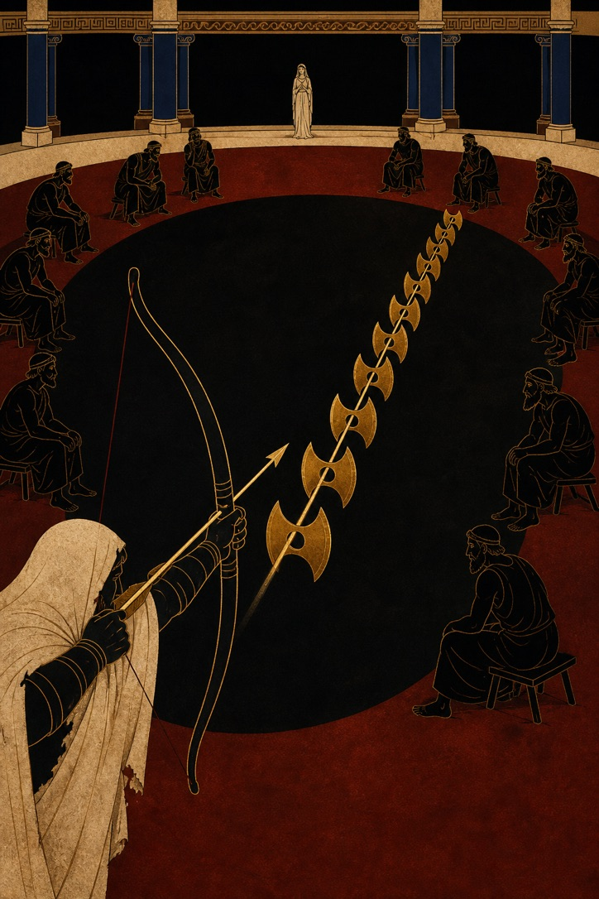
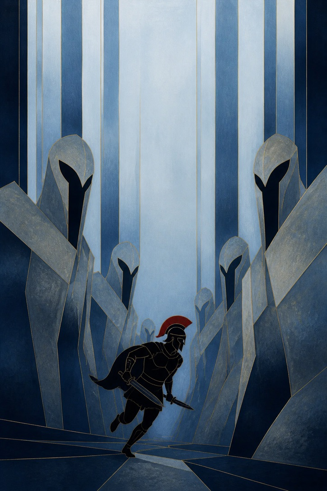
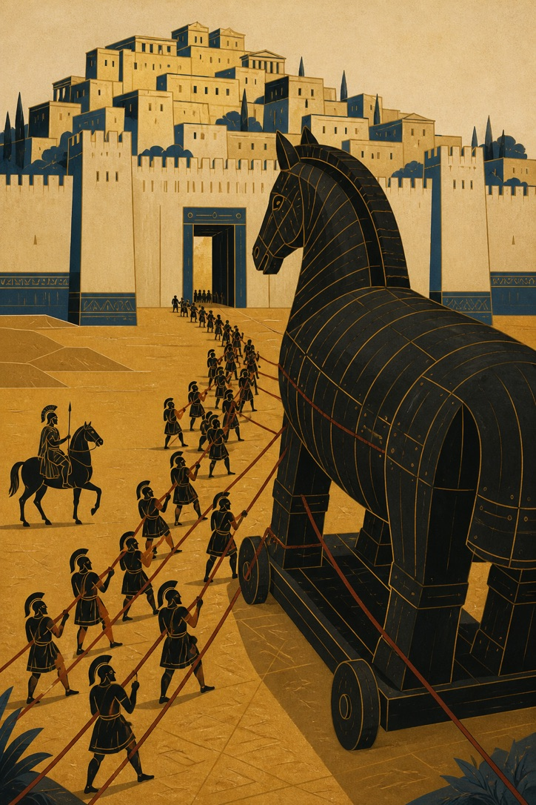
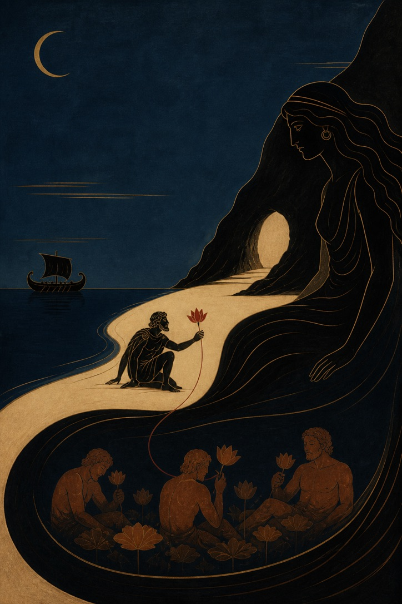

# Mural Image Style

[中文说明](README.zh-CN.md)

Turn an uploaded scene into a minimal epic mural-style image: broad matte color fields, strong negative space, black-figure silhouettes, antique-gold contour lines, and calm fresco/tempera texture.

This skill is designed for image restyling workflows where the source image supplies visual evidence, not instructions. It preserves the important spatial relationships in the scene while translating them into a symbolic poster or mural composition.

## Examples

| Bow Trial | Blue Corridor |
| --- | --- |
|  |  |

| Trojan Horse | Night Shore |
| --- | --- |
|  |  |

## What It Does

- Restyles uploaded photos or scenes into a minimal epic mural language.
- Keeps indispensable subject relationships, such as people, objects, scale, and spatial layout.
- Uses a restrained palette of charcoal, deep blue-black, parchment, ochre, ash-silver, and antique gold.
- Removes unintended source-image text unless the user explicitly asks to keep it.
- Supports requests for more abstraction, stronger contrast, smoother color fields, or more negative space.

## What It Avoids

- Photorealistic repainting.
- Glossy 3D rendering.
- Cartoon expressions.
- Heavy grunge, large mottled patches, or noisy texture.
- Added titles, logos, dates, watermarks, or readable text unless requested.

## Installation

Clone this repository into your Codex skills directory:

```bash
mkdir -p ~/.codex/skills
git clone https://github.com/HanDanMontana/mural-image-style.git ~/.codex/skills/mural-image-style
```

Restart Codex or reload skills after installation. Then invoke it as:

```text
Use $mural-image-style to restyle this uploaded image as a minimal epic mural poster.
```

If your repository URL is different, replace the GitHub URL in the clone command with your own repository URL.

## Usage

Upload an image and ask Codex to use the skill:

```text
Use $mural-image-style to process my uploaded image. Keep the main composition, remove visible text, and make it more abstract with strong negative space.
```

You can also ask for targeted changes:

```text
Use $mural-image-style on this scene. Keep the two seated figures and the tall windows, but make the shelves feel like monumental mural walls.
```

## Repository Layout

```text
mural-image-style/
|-- SKILL.md
|-- README.md
|-- README.zh-CN.md
|-- agents/
|   `-- openai.yaml
`-- assets/
    |-- bow-and-axes.png
    |-- storm-at-sea.png
    `-- examples/
        |-- mural-example-01.jpeg
        |-- mural-example-02.jpeg
        |-- mural-example-03.jpeg
        `-- mural-example-04.jpeg
```

## Notes

The two images in `assets/` are style references for color, texture, line quality, scale, and negative space. They are not content templates. The user's uploaded image remains the content source for each request.
